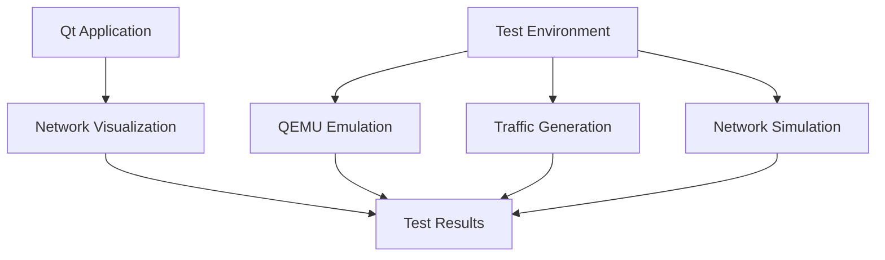

# UGNSM Project - Unified Network Simulation and Monitoring

## Overview

UGNSM is a C++17 Qt 6.8 project for **network monitoring** and **simulation testing** using a full virtualized environment based on **QEMU**, **Linux TAP interfaces**, and **Jetson Nano emulation**.

The project includes:

* 🖥 **Qt GUI app** (`ugnsm`) for real-time interface monitoring and visualization
* 🧪 **Automated testbed** with multiple traffic scenarios
* 🔁 **Fully orchestrated network stack** using Bash scripts and emulated devices

---

## Features

### Qt Application

* Visualizes real-time traffic data
* Custom widgets for interface stats
* Compact and extensible architecture (CMake + C++17)

### Network Test Environment

* Jetson Nano emulation via QEMU
* Traffic simulation: speed test, link flap, jitter
* NAT bridge setup via host interface (Wi-Fi or Ethernet)
* TAP-based multi-interface routing



---

## Build Instructions (Qt App)

### Prerequisites

* **Qt 6.8** development tools
* **CMake** >= 3.16
* **GCC** >= 9 / **Clang** >= 10 / **MSVC** 2019+
* `make` or `ninja`

### Build Steps

```bash
mkdir -p build && cd build
cmake .. \
  -DCMAKE_PREFIX_PATH=/opt/Qt/6.8.0/gcc_64 \
  -DCMAKE_BUILD_TYPE=Release
cmake --build . --parallel
./ugnsm
```

---

## Network Simulation: Unified Workflow

All tests are executed via **a single orchestrator script**:

```bash
sudo ./scripts/run_network_test.sh [uplink-iface] [scenario]
```

### Example:

```bash
sudo ./scripts/run_network_test.sh wlp0s20f3 speed
sudo ./scripts/run_network_test.sh --keep eth0 all
```

### Supported Scenarios

* `speed` — iPerf + ping throughput test
* `flap` — link up/down flapping
* `jitter` — ICMP jitter stress test
* `all` — combined scenario

### Script Flow

1. Clean up existing virtual networks
2. Set up NAT bridge using given uplink interface
3. Mount Jetson Nano guest image
4. Launch QEMU with 4 TAP interfaces
5. Set up iperf3 servers inside guest
6. Run selected test scenario
7. Clean up environment (unless `--keep` specified)

---

## Network Monitoring (Optional)

Run in a separate terminal to check TAP traffic:

```bash
sudo ./scripts/network_monitor.sh tap0 tap1 tap2 tap3
```

### Output

Uses `iftop` to visualize real-time traffic. Helpful for confirming interface activity (non-zero rates).

---

## Jetson Nano Guest Image

Download the SD card image **Jetson-Nano-Tegra210\_Linux\_R32.1.0\_aarch64.tbz2** from the official NVIDIA source:

> [https://developer.nvidia.com/embedded/downloads](https://developer.nvidia.com/embedded/downloads)

1. Extract the image:

```bash
tar xf Jetson-Nano-Tegra210_Linux_R32.1.0_aarch64.tbz2
```

2. Apply NVIDIA binaries:

```bash
cd Linux_for_Tegra
sudo ./apply_binaries.sh
```

3. Copy image into project:

```bash
mkdir -p scripts/rootfs/
cp ../sd-blob-b01.img scripts/rootfs/
```

---

## Directory Structure

```
/ (project root)
├── CMakeLists.txt
├── Core/                # C++ network logic
├── UI/                  # Custom Qt widgets
├── Utilities/           # Logging/util functions
├── Resources/           # Icons, translations
├── main.cpp             # Entry point
├── mainwindow.*         # Main window
├── scripts/             # Bash orchestration scripts
│   ├── run_network_test.sh       # Test runner (main entry)
│   ├── network_monitor.sh        # Realtime traffic viewer
│   ├── setup_nat_bridge.sh      # NAT bridge setup
│   ├── prepare_guest_image.sh   # Image mounting + SSH
│   ├── qemu_network_tester.sh   # QEMU with 4 TAPs
│   ├── simulate_network_traffic.sh  # Traffic load gen
│   ├── setup_guest_iperf.sh     # Guest service config
│   └── cleanup_networks.sh      # Bridge + TAP cleanup
```

---

## Logs and Debugging

* Main test log: `/tmp/network_test_logs/full_test.log`
* QEMU boot log: `/tmp/qemu_network_tester.log`
* iPerf setup: `/tmp/setup_guest_iperf.log`

### Common Issues

| Problem                     | Fix                                                   |
| --------------------------- | ----------------------------------------------------- |
| Image not mounting          | Check path under `scripts/rootfs/`, use `fdisk -lu`   |
| QEMU not starting           | Verify `kernel/Image`, DTB, permissions               |
| Guest not reachable via SSH | Wait \~60s, check ssh key access setup                |
| NAT bridge no internet      | Check `iptables -t nat -L` and `brctl show br-jetson` |

---

## License

This project is licensed under the **GNU General Public License v3.0 (GPL-3.0)**. See the `LICENSE` file for full terms.

---

